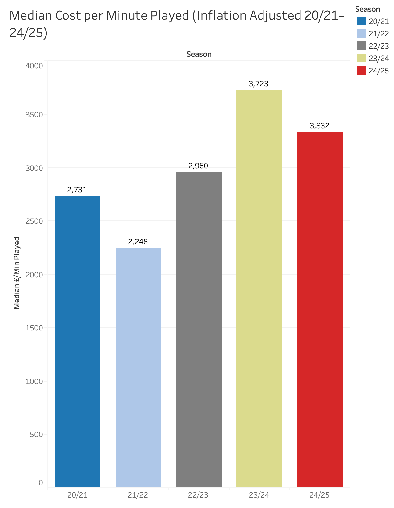
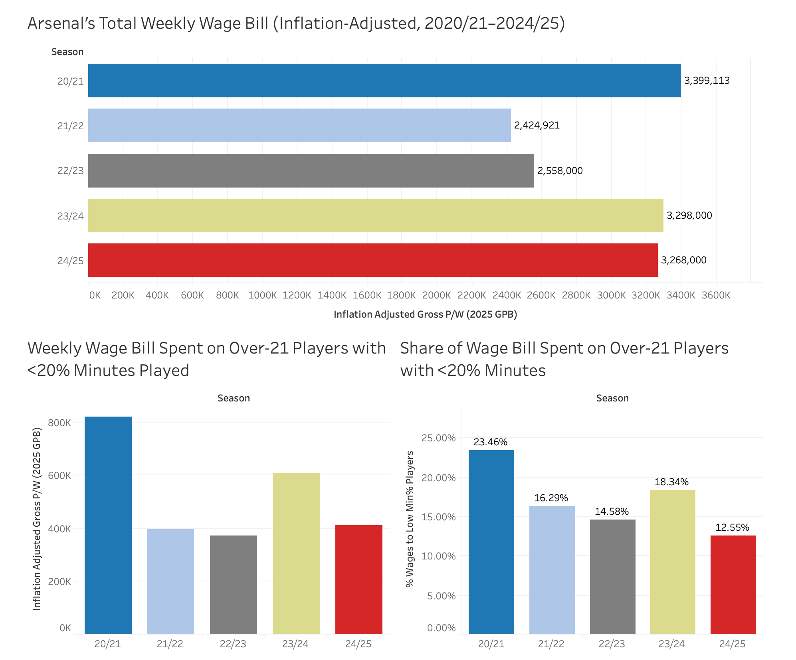
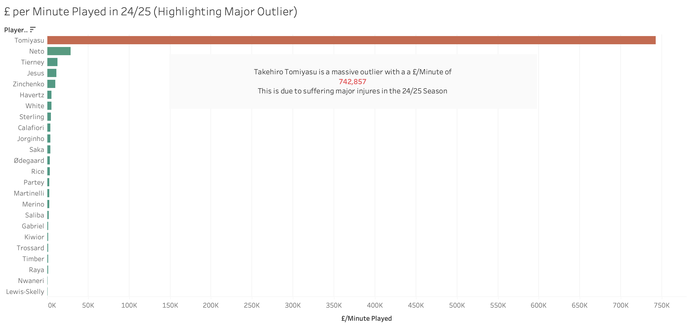
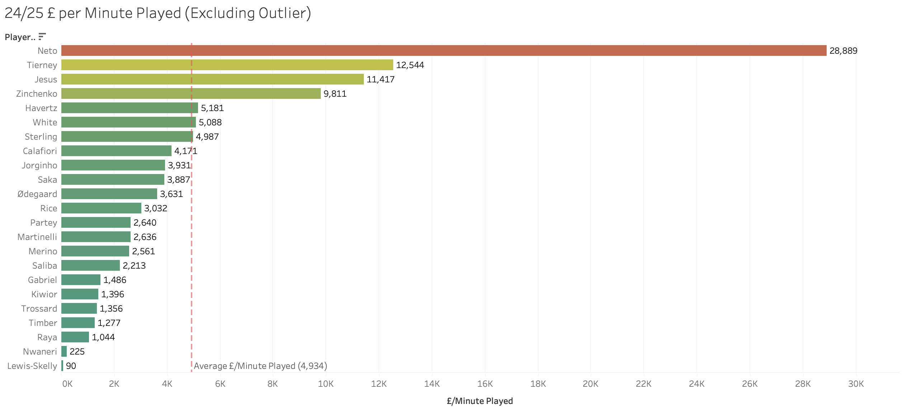
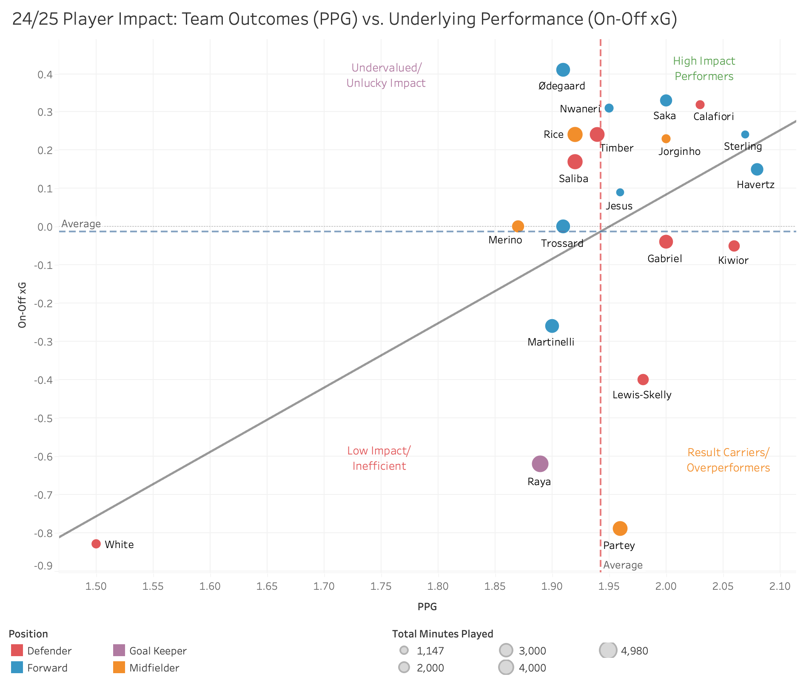
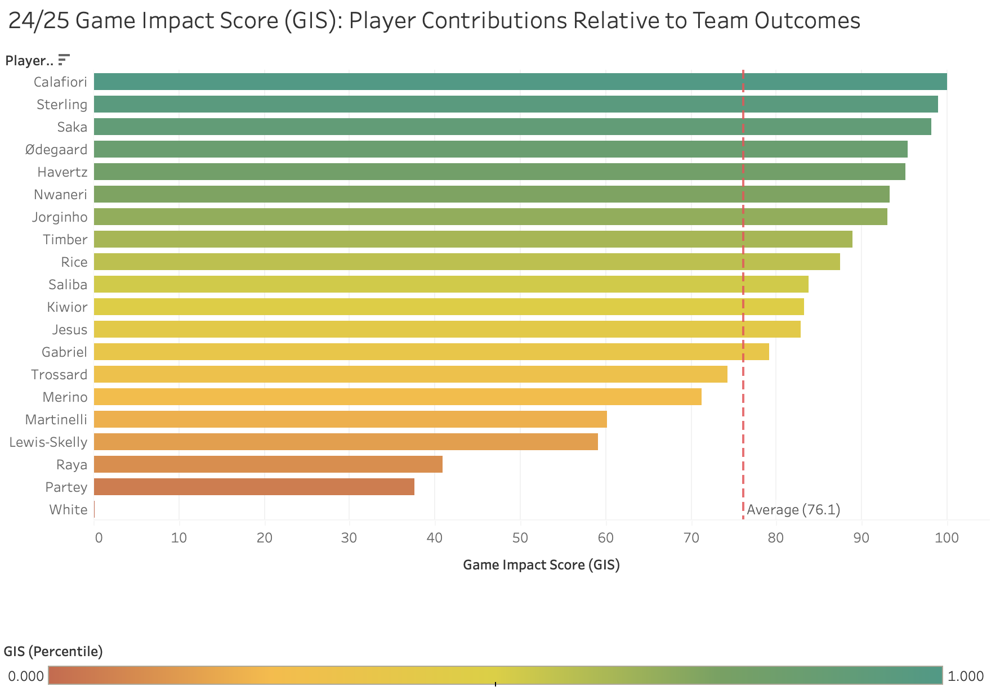

# Analysis of Arsenal FC Squad Value

This project analyzes Arsenal’s wage bill efficiency by combining historic salary data, playing time, and a custom Game Impact Score (GIS) to evaluate player value relative to squad performance. Built with Python, Excel, and Tableau, the project answers five key questions surrounding changes in wage allocation over time, wage inefficiencies, player impact on performance impact, and alignment between wages and contribution, concluding with recommendations compared to Arsenal’s real-world contract decisions.
### Questions Answered
1. How has the average cost/minute played changed over time?
2. How much of the wage bill is wasted on underused players?
3. Who is overpaid relative to minutes?
4. Which players have the biggest impact on games (via GIS)?
5. Does impact align with wages—who are bargains vs inefficiencies?

---

## Tools and Technologies
- **Python** – Programmatic data scraping (`selenium`, `pandas`)
- **Excel** – For data cleaning, transformation, and exports
- **Tableau** – For interactive dashboards, visual storytelling, GIS creation using table calculations

---

## Project Workflow

### 1. Python: Data Collection
Used the selenium and pandas libraries to:
- Pull wage tables by season (2020/21→2024/25) from Capology
- Pull playing-time and impact stats from FBref (minutes, PPG/PPM, on–off xG context)
- Put them into separate data frames and export them as CSV files

**Output:** Two CSV files (`arsenal_minutes_played_2020_2025_fbref.csv`)  and `arsenal_salaries_2020_2025.csv`.

### 2. Excel: Cleaning & Harmonization
Using excel:
- Normalized names across datasets
- Cleaned NULLs and empty rows
- Created a unique key for each player for each season
- Used VLOOKUP to create a single table with the relevant data

**Output:** A clean excel table `arsenal_combined_data.xlsx` 

### 3. Tableau: Game Impact Score Creation
Built table calculations in Tableau to create a Game Impact Score (GIS) mertic, weighting:
- Points Per Game (PPG)
- On-Off xG impact (team performance with vs without player)
- Created calculated fields and parameter controls to test different weightings
- Used Tableau normalization (percentiles) to compare across players/seasons

**Output:** Dynamic GIS field + normalized scores within Tableau workbooks

### 4. Tableau: Data Visualization
Final visualizations were built in Tableau (`link`) to visually answer the five research questions:
- Wage/Minute Over Time → tracked wage efficiency trends across seasons
- Overpaid vs Minutes → highlighted wages spent on underused players
- Wasted Wage Bill → compared total vs wasted wages by year
- Game Impact Score (GIS) → identified top contributors vs low-impact players
- Wages vs Impact → quadrant plot of bargains, justified earners, and inefficiencies

---

### Question 1: How has the cost/minute changed over time?

The data shows that Arsenal’s median cost per minute played dropped significantly from £2,731 in 20/21 to £2,248 in 21/22, reflecting early squad trimming and better utilization of wage spend. However, efficiency dipped in later seasons, peaking at £3,723 in 23/24 before improving slightly in 24/25 (£3,332).

This trend highlights a diagnostic insight: as Arsenal invested in higher-caliber players during their title challenge years (23/24–24/25), wage inflation outpaced the efficiency gains of previous seasons. Injuries and rotation further drove up the cost per effective minute.

From an optimization standpoint, the club should continue to monitor whether premium wages translate into consistent availability and impact. If not, future contracts need stricter alignment to minutes played or performance metrics.

Strategically, this analysis suggests Arsenal has moved from cutting “deadwood” to the harder task of ensuring elite wages are justified by elite contributions. The risk now is less about wasted contracts and more about sustaining efficiency in a high-spend, title-chasing era.

### Question 2: How much of the wage bill is wasted on underused players?

Arsenal’s total weekly wage bill has fluctuated between **£2.4M** and **£3.4M** over the last five seasons, with the biggest dip in 21/22 reflecting the club’s post-pandemic reset. By 23/24 and 24/25, wages returned to the £3.2–3.3M range—close to 20/21 levels in absolute terms. However, the picture looks different when framed against revenue: with turnover growing from £367M in 20/21 to £616.6M in 23/24, wages now represent a smaller share of total income, meaning **Arsenal’s financial capacity to sustain a large wage bill has actually improved**.

At the same time, the share of wages spent on underused players has steadily declined. In 20/21, nearly a quarter of the wage bill went to players featuring in less than 20% of minutes. By 24/25, this figure was just 12.5%. The club has clearly reduced “dead money” tied up in fringe contracts, a shift that reflects smarter squad management and fewer legacy deals weighing down the balance sheet.

The strategic takeaway is twofold: **Arsenal not only trimmed inefficiencies but also grew into their wage bill as revenues surged**. With projected income in 24/25 estimated between £650M–£850M, even maintaining wages at current levels would leave the club in a stronger financial position than peers struggling with static revenues. Going forward, the challenge isn’t the size of the wage bill but ensuring new contracts continue to track player impact rather than sentiment or short-term hype.

### Question 3: Who is overpaid relative to minutes?

The raw £/minute figures for 24/25 highlight **Takehiro Tomiyasu** as an extreme outlier, costing nearly **£743K per minute played** due to major injuries that kept him sidelined for most of the season. Because his case reflects extraordinary circumstances rather than structural inefficiency, he is excluded from some of the further analysis to avoid skewing the dataset.

Looking at the adjusted table without Tomiyasu, a clearer picture emerges. Players such as **Neto (£28.9K/min)**, **Tierney (£12.5K/min)**, **Jesus (£11.4K/min)**, and **Zinchenko (£9.8K/min)** stand out as costly relative to their availability. These players not only carry high wages but also offer limited minutes, raising questions about their reliability as long-term contributors.

The next step is to monitor whether this pattern persists across other metrics. If these names continue appearing among the least efficient by team contribution as well, it strengthens the case for either renegotiation or exit. This kind of analysis ensures Arsenal doesn’t just cut “deadwood” once but maintains a disciplined wage-to-contribution balance year after year.

### Question 4: Which players have the biggest impact on games (via GIS)?

